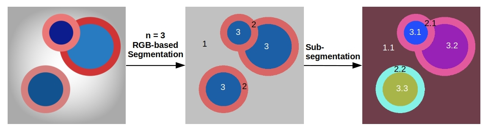

# RGB2oSeg
RGB based 2<sup>nd</sup> order Image Segmentation.<br>
* Segmenting image in top 'n' colors present ['n' is given by user].<br>
* Using RGB image format and KMeans clustering algo.<br>
* Sub-labelling dissconnected pixel sections belonging to same Cluster.<br>
### RGB based 2<sup>nd</sup> order Segmentation shown with Labelling


## Usage
**Note:** Run the following codes in command terminal.<br>
### 1. Clone the repository
```
git clone https://github.com/moksh-401-511/RGB2oSeg.git
```
### 2. Running Segmentation
Paste image into 'Image' directory present in RGB2oSeg dir<br>
In command terminal, move to RGB2oSeg directory.
```
# -i : (test_image.png) input image name
# -c : (2/3/4..) number of clusters to segment image
# -s : (1/0) whether to perform sub-segmentation
python RGB-sub-segmentation.py -i test_image.png -c 3 -s 1
```
Segmented images will be stored in 'Segmented_images' directory and corresponding labeled matrices (for both segmentation and sub-segmentation) are stored as numpy-binary file in 'labeled_img_matrix' directory. More info about how to read these numpy-binary files, [refer code snippet](https://github.com/moksh-401-511/RGB2oSeg/blob/29444742253c0945f9f1835e58140f8dda8358f4/RGB-sub-segmentation.py#L176).

### 3. Example
Some example outputs of [Images](https://github.com/moksh-401-511/RGB2oSeg/tree/main/Images) are given in [Segmented_images](https://github.com/moksh-401-511/RGB2oSeg/tree/main/Segmented_images) directory.
